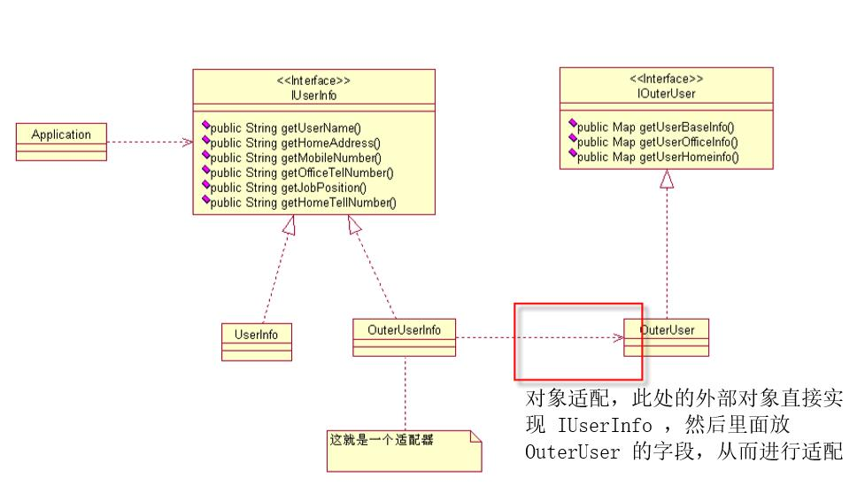
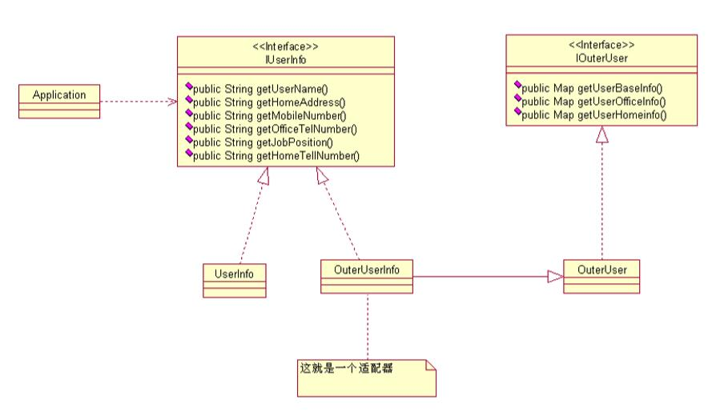

# 适配器设计模式
分为两类：
1. 对象适配
 > 对象适配，就是在适配类里面，放入 外部对象的字段，适配器(OutUserToInObject)实例化的时候，自动实例化 OutUserInfo 对象，或者在构造方法里面传入

2. 类适配
> 类适配，就是在适配类(OutUserToIn)里面，继承 外部对象的类(OutUserInfo),从而进行 调用外部对象的方法，转化为本系统的用户对象

思维导图：
1. 对象适配模式

2. 类适配模式

