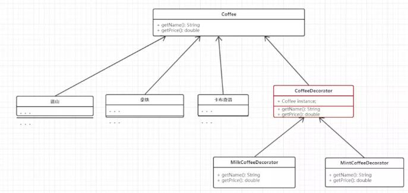

# 装饰器设计模式
本例子示例了，一个咖啡店里面的咖啡加上别的小料之后价格不一样，名字不一样

* 因为咖啡可能有很多种，所以抽象一个 Coffer 类
* 创建 CofferDecoration 装饰类，用来装饰 Coffer,所以里面有一个 Coffer 的属性，然后实例化该方法的时候，讲 Coffer 对象传进去，并且该类也继承 Coffer 类
* 然后创建 MilkCofferDecoration 类，继承 CofferDecoration 类，重写 getName(),getPrice() 方法

最后调用

总结：
1. 通过装饰器模式可以动态的将责任附加到原有的对象上，而不改变原有的code。
2. 遵循 **开闭原则** 
3. 装饰器和被装饰者有相同的祖先 (比如说 CofferDecoration 和 Coffer)
4. 可以用多个装饰器装饰同一个对象 (比如说 咖啡可以加牛奶还可以加椰子)
5. 装饰者可以在被装饰者的行为之前或之后动态的加上自己的行为。(参考装饰实现)
6. 组合比继承更加的灵活（上面的coffee代理）

### 使用例子
比如说 BufferedInputStream();
该类里面就有 InputStream 的属性，并且具有同一个父类

代码参考文档： https://www.jianshu.com/p/baa9f36d8367

### 思维导图
